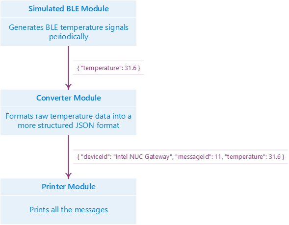

# Azure IoT Edge BLE Data Converter Module with NODEJS

## Overview

This tutorial showcases how one might build a module for Azure IoT Edge in NODEJS.

In this tutorial, we will walk through environment setup and how to write a [BLE](https://en.wikipedia.org/wiki/Bluetooth_Low_Energy) data converter module using the latest Azure IoT Edge NPM packages.

## Prerequisites

In this section, you will setup your environment for IoT Edge module development. It applies to both *64-bit Windows* and *64-bit Linux (Ubuntu 14+)* operating systems.

The following software is required:
1. [Git Client](https://git-scm.com/downloads).
2. [Node LTS](https://nodejs.org).
3. `npm install -g yo`.
4. `npm install -g generator-az-iot-gw-module`

## Overall Architecture

The Azure IoT Edge platform heavily adopts the [Von Neumann architecture](https://en.wikipedia.org/wiki/Von_Neumann_architecture). Which means that the entire Azure IoT Edge architecture is a system which processes input and produces output; and that each individual module is also a tiny input-output subsystem. In this tutorial, we will introduce the following two modules:

1. A module which receives a simulated [BLE](https://en.wikipedia.org/wiki/Bluetooth_Low_Energy) signal and converts it into a formatted [JSON](https://en.wikipedia.org/wiki/JSON) message.
2. A module which prints the received [JSON](https://en.wikipedia.org/wiki/JSON) message.

The below image displays the typical end-to-end dataflow for this project:

## Implementing the Code

### Scallfodding

### NODEJS Project Structure

### Package File

### Entry File

### Converter Module

### Printer Module

### Configuration

## Running the Modules

## Quick Reference

