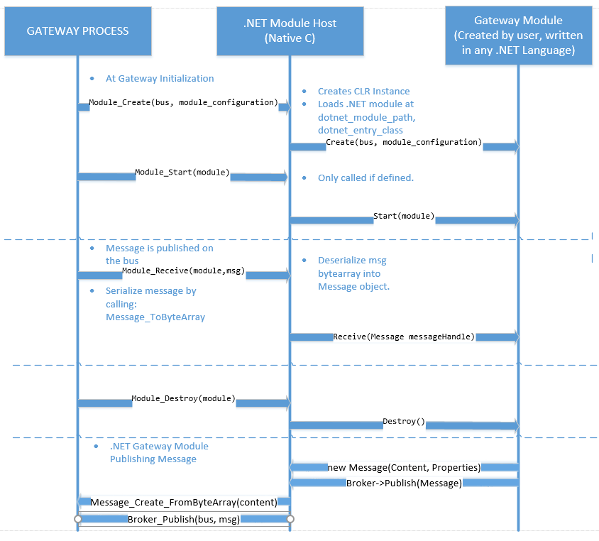

.NET NuGet Package for Windows Desktop
===============================

Overview
========

This sample showcases how one might build modules for Azure IoT Edge in .NET.

The sample contains:

1. A printer module (C#) that interprets telemetry from sensor and prints its content and properties into Console.
2. A sensor module (C#) that publishes random data to the IoT Edge.
3. The .NET Microsoft.Azure.IoT.Gateway interface assembly.
4. A sample native (C) IoT Edge executable (gw.exe) file.
5. The native (C) binding layer interfaces for .NET, Java, and NodeJs (C). Which includes `aziotsharedutil.dll`, `dotnet.dll`, `dotnetcore.dll`, `gateway.dll`, `gw.exe`, `identity_map.dll`, `iothub.dll`, `iothub_client.dll`, `iothub_service_client.dll`, `java_module_host.dll`, `logger.dll`, `nanomsg.dll`, `node.dll`, `nodejs_binding.dll`, `simulated_device.dll`, and `serializer.dll`.
6. The `Microsoft.Azure.IoT.Gateway.dll` (C#) which contains the Azure IoT Edge module interface definition.
7. A `module_dev_sample.json` file that is used to configure which module the IoT Edge will use.

Prerequisites
=============
1. Microsoft Visual Studio 2015.
2. Make sure you have .NET Framework installed. Our current version of the binding was tested and loads modules written in .NET version v4.6.01586.
3. The [Microsoft .NET Framework 4.5](https://www.microsoft.com/en-us/download/details.aspx?id=30653).

How does the data flow through the IoT Edge
===========================================
You can find the diagram for Receiving a message and publishing a message on this flow chart:



Running the sample
==================
1. Build the DotnetModuleSample project (Ctrl + Shift + B).
2. Click the `Start` button in the Visual Studio 2015 IDE or press the F5 key.

**NOTE:** If you are making your own `Azure IoT Edge` module project and are unable to get the `Microsoft.Azure.Devices.Gateway.Native.Windows.x64` NuGet package binaries to bin place to the output directory you will need to add the below `XML` to your `.csproj` file to invoke the targets file before the MSBuild process builds your project.

**XML:**

```xml
  <Import Project="..\packages\Microsoft.Azure.Devices.Gateway.Native.Windows.x64.1.1.3\build\Microsoft.Azure.Devices.Gateway.Native.Windows.x64.targets" Condition="Exists('..\packages\Microsoft.Azure.Devices.Gateway.Native.Windows.x64.1.1.3\build\Microsoft.Azure.Devices.Gateway.Native.Windows.x64.targets')" />
  <Target Name="EnsureNuGetPackageBuildImports" BeforeTargets="PrepareForBuild">
    <PropertyGroup>
      <ErrorText>This project references NuGet package(s) that are missing on this computer. Use NuGet Package Restore to download them.  For more information, see http://go.microsoft.com/fwlink/?LinkID=322105. The missing file is {0}.</ErrorText>
    </PropertyGroup>
    <Error Condition="!Exists('..\packages\Microsoft.Azure.Devices.Gateway.Native.Windows.x64.1.1.3\build\Microsoft.Azure.Devices.Gateway.Native.Windows.x64.targets')" Text="$([System.String]::Format('$(ErrorText)', '..\packages\Microsoft.Azure.Devices.Gateway.Native.Windows.x64.1.1.3\build\Microsoft.Azure.Devices.Gateway.Native.Windows.x64.targets'))" />
  </Target>
```  

References
==========
[Azure IoT Edge](https://azure.microsoft.com/campaigns/iot-edge/)